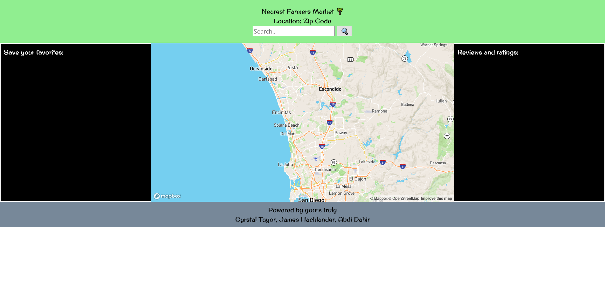

# Farmers Market Search
## A web app to show you farmers market locations for your area

### Description:
This page is intended to help you find local farmers markets. Upon entering a zip code, the map will display a collection of farmers markets in the area and display their location on the map. You can view their address, schedule, and a list of products offered. Favorite markets can be saved to a favorites list to ease finding them again later.

### User Story
AS A consumer
I WANT to locate and view the schedule and available products of farmers markets in my area.
SO THAT I can find the closest market that fits my needs.

### Technologies Used:
- HTML
- CSS
- JS
- Bulma
- Jquery
- Google Fonts
- Mapbox

### Website Preview:
 

### Links:
[Link to deployed website](https://monsaltus.github.io/Farmers-Market-Search/)

### Changelog:
#### index.html:
#### style.css:
#### script.js: